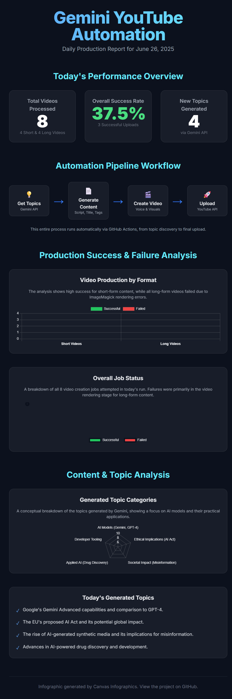

# Gemini YouTube Automation

An automated YouTube content creation system that generates AI-focused educational videos using Google's Gemini API. The system creates both long-form lessons and YouTube Shorts, complete with voiceovers, visuals, and automatic uploads.

## 🎥 Sample Output

Check out videos created by this automation:

- **Long-form lesson**: [Decentralized AI: Building Robust and Scalable Systems](https://youtu.be/4Hc7yCkpALQ?si=6P1XADmtAQQGBt4z)
- **YouTube Short**: [Quick AI Tip](https://youtube.com/shorts/PcHtECKCCnE?si=ZqQ9dPtmr_A-NLeS)

## 🚀 Features

- **Automated Content Generation**: Uses Gemini AI to create educational lesson plans and scripts
- **Dual Video Format**: Generates both long-form videos and YouTube Shorts
- **Text-to-Speech**: Converts scripts to natural-sounding voiceovers using gTTS
- **Visual Generation**: Creates custom thumbnails and slide images
- **YouTube Integration**: Automatically uploads videos with metadata, tags, and thumbnails
- **Progress Tracking**: Maintains a curriculum plan and tracks completed lessons

## 📁 Project Structure

```text
gemini-youtube-automation/
├── .github/
│   └── workflows/
│       └── main.yml         # GitHub Actions workflow (daily automation)
├── src/
│   ├── __init__.py          # Package initializer
│   ├── generator.py         # Content generation and video creation
│   └── uploader.py          # YouTube upload functionality
├── assets/
│   ├── fonts/               # Fonts for video text rendering
│   └── music/               # Background music files
├── output/                  # Generated videos and assets (gitignored)
├── .env                     # API keys (gitignored)
├── .gitignore
├── content_plan.json        # Curriculum and lesson tracking
├── main.py                  # Main entry point
├── requirements.txt         # Python dependencies
└── README.md
```

## 🛠️ Setup Instructions

### 1. Clone the Repository

```bash
git clone https://github.com/usm4nhafeez/gemini-youtube-automation.git
cd gemini-youtube-automation
```

### 2. Create Virtual Environment

```bash
python -m venv myenv
myenv\Scripts\activate  # Windows
# or
source myenv/bin/activate  # Linux/Mac
```

### 3. Install Dependencies

```bash
pip install -r requirements.txt
```

### 4. Configure Environment Variables

Create a `.env` file in the project root:

```env
GOOGLE_API_KEY=your_gemini_api_key_here
PEXELS_API_KEY=your_pexels_api_key_here
```

**Get your API keys:**

- **Gemini API**: https://aistudio.google.com/app/apikey
- **Pexels API**: https://www.pexels.com/api/

### 5. Set Up YouTube OAuth Credentials

#### Step 1: Create Google Cloud Project

1. Go to [Google Cloud Console](https://console.cloud.google.com/)
2. Create a new project (e.g., "YouTube Automation Bot")
3. Enable **YouTube Data API v3**:
   - Navigate to **APIs & Services → Library**
   - Search for "YouTube Data API v3"
   - Click **Enable**

#### Step 2: Configure OAuth Consent Screen

1. Go to **APIs & Services → OAuth consent screen**
2. Choose **External** user type
3. Fill in required fields:
   - App name: `YouTube Automation Bot`
   - User support email: Your email
   - Developer contact: Your email
4. Click **Save and Continue**
5. **Add Test Users**:
   - Click **Add Users**
   - Enter the Google account email that owns your YouTube channel
   - Click **Save**

#### Step 3: Create OAuth Client ID

1. Go to **APIs & Services → Credentials**
2. Click **+ CREATE CREDENTIALS → OAuth client ID**
3. Choose **Desktop app** as application type
4. Name it (e.g., "YouTube Uploader")
5. Click **Create**
6. **Download** the JSON file
7. **Rename** it to `client_secrets.json`
8. Place it in the project root directory

### 6. First Run - Authenticate

```bash
python main.py
```

On the first run:

1. A browser window will open
2. Sign in with the Google account you added as a test user
3. Select your YouTube channel
4. Grant the requested permissions
5. The script will create `credentials.json` automatically
6. Video generation and upload will begin

### 7. Managing Content

#### Initial Content Plan

The script uses `content_plan.json` to track lessons. On first run, it generates a 20-lesson AI curriculum using Gemini.

#### Adding New Content

When all lessons are complete, you can:

1. **Manual Method**: Edit `content_plan.json` and add new lessons:

   ```json
   {
     "chapter": 11,
     "part": 1,
     "title": "Your New Lesson Title",
     "status": "pending",
     "youtube_id": null
   }
   ```

2. **Automatic Method**: Delete or rename `content_plan.json` and run the script again to generate a fresh curriculum.

## 📝 Usage

### Run Locally

```bash
python main.py
```

The script will:

1. Load the content plan
2. Find the next pending lesson
3. Generate lesson content using Gemini
4. Create long-form video and YouTube Short
5. Upload both to YouTube
6. Mark the lesson as complete
7. Update `content_plan.json`

### GitHub Actions (Optional)

The included workflow runs daily at 7:00 AM UTC. To use it:

1. Add repository secrets:

   - `GOOGLE_API_KEY`
   - `PEXELS_API_KEY`
   - `CLIENT_SECRETS_JSON` (contents of `client_secrets.json`)
   - `CREDENTIALS_JSON` (contents of `credentials.json` after first auth)

2. Enable GitHub Actions in your repository

## 🔧 Customization

### Change Content Niche

Edit `src/generator.py` and modify the `generate_curriculum()` function to change the topic focus.

### Adjust Video Settings

- **Video duration**: Modify slide count in `generate_lesson_content()`
- **Voice settings**: Adjust gTTS parameters in `text_to_speech()`
- **Visual style**: Edit `generate_visuals()` for custom thumbnails and slides

### Modify Upload Frequency

Change `LESSONS_PER_RUN` in `main.py` (default: 1 lesson per run)

## 📊 Daily Production Infographic



## 🤝 Contributing

Contributions are welcome! Please:

1. Fork the repository
2. Create a feature branch
3. Make your changes
4. Submit a pull request

## 📄 License

This project is licensed under the MIT License. See the LICENSE file for details.

## 🙏 Credits

Created by [usm4nhafeez](https://github.com/usm4nhafeez)

Based on the original concept by [ChaituRajSagar](https://github.com/ChaituRajSagar)
